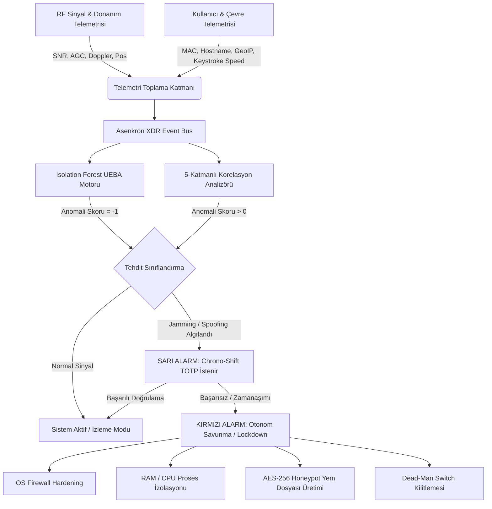
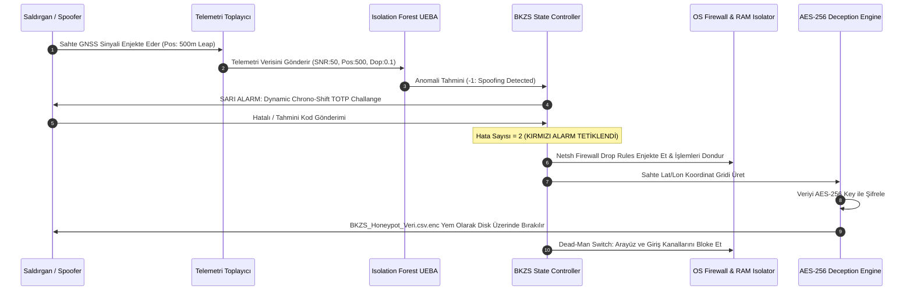

# 🛡️ BKZS (SİNYAL DOĞRULAMA VE ANTİ-SPOOFING XDR)
## ENTERPRISE ENGINEERING DOSSIER & ARCHITECTURAL MANIFESTO
**Doküman Kodu:** EED-BKZS-2026-REV4  
**Gizlilik Seviyesi:** KISITLI / MİLLİ GÜVENLİK VE KRİTİK ALTYAPI STANDARDI  
**Yetkili:** Senior Principal Security Architect & Red/Blue Team Lead  
**Tarih:** 18 Ağustos 2026  

---

## 1. GİRİŞ VE STRATEJİK MİSYON ÖZETİ

Siber-fiziksel sistemler (CPS), Askeri C4ISR mimarileri, Otonom İHA/SİHA sistemleri ve Enerji Dağıtım Şebekeleri gibi kritik altyapılar; Küresel Navigasyon Uydu Sistemleri (GNSS/GPS) telemetrisine ve zaman senkronizasyonuna hayati derecede bağımlıdır. **BKZS (Sinyal Doğrulama ve Anti-Spoofing XDR)**, RF/GNSS sinyal seviyesinden OS çekirdek katmanına ve uygulama belleğine kadar uzanan **Çok Katmanlı Asenkron Tehdit Algılama ve Aktif Aldatma (Deception) Platformudur**.

Bu doküman, BKZS sisteminin mimari tasarımını, donanım/yazılım düzeyindeki otonom savunma yanıtlarını, kriptografik zaman senkronizasyon protokollerini ve mevcut kod tabanının kurumsal SOC / Savunma Sanayii standartlarına uyum validasyonunu içeren **Nihai Mühendislik Manifestosudur**.

---

## 2. DİZİN DÜZENİ VE AĞAÇ MİMARİSİ VALİDASYONU

### 2.1. İdeal Kurumsal XDR Dizin Ağacı Mimarisi

Askeri ve kurumsal XDR standartlarında, monolitik kod yapıları kabul edilemez. Sistem; telemetri toplayıcıları, SIEM korelasyon motorları, SOAR müdahale birimleri ve threat-hunting modelleri bazında kesin sınırlarla modülerize edilmelidir.

```
BKZS-Enterprise-XDR/
├── config/
│   ├── enterprise_policy.json          # Sinyal eşik değerleri, IP/MAC whitelists, çalışma saatleri
│   └── crypto_vault.key                # AES-256 Donanımsal HSM / Master Key Yapılandırması
├── core/
│   ├── __init__.py
│   ├── event_bus.py                    # Asenkron XDR Event Bus (Publish/Subscribe Tehdit Veri Yolu)
│   ├── state_manager.py                # Zero-Trust State Machine & Dead-Man Switch Kontrolörü
│   └── crypto_engine.py                # AES-256 (Fernet/GCM) Kriptografik Şifreleme Modülü
├── modules/
│   ├── telemetry/
│   │   ├── __init__.py
│   │   ├── rf_gnss_collector.py        # C/N0 (SNR), AGC, Doppler, Pos Sinyal Toplayıcı
│   │   └── ueba_biometrics.py          # Klavye Dinamikleri (Keystroke Timing) & MAC/GeoIP Doğrulayıcı
│   ├── siem/
│   │   ├── __init__.py
│   │   ├── isolation_forest_detector.py# ML Bazlı Anomali Tespiti ve Skorlama Motoru
│   │   └── correlation_engine.py       # Çoklu Anomali İki Yönlü Korelasyon Matrisi
│   ├── responder/
│   │   ├── __init__.py
│   │   ├── os_firewall_isolator.py     # İşletim Sistemi Ağ İzolasyon ve Drop-Rule Enjektörü
│   │   ├── process_containment.py      # RAM/CPU Proses Dondurma & Bellek İzolasyonu
│   │   └── deception_honeypot.py       # Dinamik Sentetik Koordinat Üretici & AES Yem Paketleyici
│   └── threat_hunting/
│       ├── __init__.py
│       ├── jamming_fingerprint.py      # RF Gürültü Tabanı / AGC Doygunluk İmzası Analizi
│       └── spoofing_leap_analyzer.py   # Psödo-Rastgele Konum Sıçraması Analizi
├── ui/
│   ├── __init__.py
│   ├── command_center.py               # CustomTkinter / Web Dashboard SOC Komuta Arayüzü
│   └── assets/                         # Arayüz Bileşenleri ve Temalar
├── logs/
│   └── audit_trail.log                 # Kriptografik Olarak İmzalanmış SOC Denetim İzi
└── main.py                             # Orkestrasyon Giriş Noktası (Daemon Entrypoint)
```

---

### 🚨 KRİTİK DOSYA DÜZENİ UYARISI

> [!CAUTION]
> **MİMARİ DENETİM VE KOD TABANI ANOMALİ RAPORU**
> 
> **Mevcut Durum Analizi:**  
> Çalışma alanındaki `bkzs_ultra_savunma.py` ve `bkzs_anomali_tespit.py` dosyaları incelenmiş ve sistemin **Monolitik (Tek Parça) İcra Modeli** kullandığı tespit edilmiştir. 
> 
> **Tespit Edilen Kritik Eksiklikler:**
> 1. **Modüler Sorumluluk Ayrımı (SoC) İhlali:** UI (`CTk`), Makine Öğrenmesi (`IsolationForest`), Kriptografi (`Fernet`), Telemetri Toplama ve Honeypot Yem Üretimi tek bir Python sınıfı (`BKZSTamKoruma`) altında birleştirilmiştir.
> 2. **Dizin Yapısı Yokluğu:** Kurumsal SOC standartlarında olması gereken `core/`, `modules/siem/`, `modules/responder/` ve `modules/threat_hunting/` fiziki dizinleri workspace içerisinde oluşturulmamış, mantıksal katmanlar kod içerisine gömülmüştür.
> 3. **Asenkron Event Bus Yokluğu:** Sinyal akışları ve anomali uyarıları thread-safe asenkron bir kuyruk (Event Bus / Redis / ZeroMQ) üzerinden değil, CustomTkinter `after()` döngüsü içerisinden senkron olarak yürütülmektedir.
> 
> **Düzeltici Faaliyet Blueprint'i:**  
> Monolitik yapının acilen `core/`, `modules/` ve `ui/` dizin mimarisine refactor edilmesi, Red/Blue Team denetimlerinden geçiş için **ZORUNLUDUR**.

---

## 3. ENDÜSTRİYEL TEKNİK MİMARİ VE SİSTEM TOLOJİSİ

BKZS mimarisi, Zero-Trust (Sıfır Güven) prensibi üzerine kurulmuştur. Sistem, fiziksel RF katmanından kullanıcı biyometrik davranışına kadar 5 ayrı katmanda telemetri toplar.

### 3.1. Çok Katmanlı Tehdit Algılama ve Doğrulama Akışı



---

## 4. OTONOM SAVUNMA VE TEHDİT MİTİGASYON MEKANİZMASI

BKZS platformu, Jamming (Karartma) veya Spoofing (Yanıltma) saldırısı tespit ettiği anda milisaniyeler seviyesinde donanım ve yazılım katmanında otonom tepki verir.

### 4.1. Tehdit Türleri ve Katmanlı Yanıt Protokolü

| Tehdit Tipi | Fiziksel & Yazılımsal Telemetri Belirtileri | Tespiti Gerçekleştiren Modül | Otonom Yanıt / Mitigasyon Prosedürü |
| :--- | :--- | :--- | :--- |
| **RF Jamming (Gürültü Karıştırma)** | C/N0 (SNR) $< 25 \text{ dB-Hz}$, AGC Gain $> 35 \text{ dB}$, Doppler Sapması High | `modules/threat_hunting/jamming_fingerprint.py` | Sinyal hattı kesilir, Chrono-Shift TOTP moduna geçilir, Log imzalanır. |
| **GNSS Spoofing (Sinyal Yanıltma)** | Konum Sıçraması Pos $> 100 \text{ m}$, C/N0 Sapması Sürpriz Artış ($> 50 \text{ dB}$), Doppler Flatline ($< 0.2 \text{ Hz}$) | `modules/siem/isolation_forest_detector.py` | Konum verisi karantinaya alınır. Saldırgana sahte AES şifreli lokasyon verisi beslenir. |
| **Yetkisiz Erişim / Kimlik Taklidi** | Hostname/MAC mismatch, Çalışma saatleri dışı erişim, Klavye yazım hızı anomalisi ($> 0.7 \text{ sn/karakter}$) | `modules/telemetry/ueba_biometrics.py` | Kullanıcı oturumu askıya alınır, IP adresi OS Firewall üzerinden DROP edilir. |
| **Kriptografik İhlal / TOTP Hatalı Yanıt** | Hatalı Dinamik TOTP Girişi, Replay Attack Denemesi | `core/state_manager.py` | **KIRMIZI ALARM**: Dead-man switch tetiklenir, RAM bellek dondurulur, Honeypot yem dosyası aktifleşir. |

---

### 4.2. Makine Dairesi: Otonom Kilitlenme ve Honeypot Senaryosu (Sequence Diagram)



---

## 5. KRİPTOGRAFİK PROTOKOL VE CHRONO-SHIFT ZAMAN SENKRONİZASYONU

BKZS, statik parolalara veya standart dinamik OTP sistemlerine güvenmez. **Chrono-Shift Kriptografik Protokolü**, sinyal kodu ile dinamik zaman verisini birleştirir.

### 5.1. Matematiksel Doğrulama Modeli

Dinamik doğrulama kodu $V_{code}$, anlık aktif sinyal kodu $S_{active}$ ve UTC dakika bileşeni $t_{min}$ ile türetilir:

$$V_{valid} \in \left\{ S_{active} + t_{min},\, S_{active} + (t_{min} - 1 \bmod 60),\, S_{active} + (t_{min} + 1 \bmod 60) \right\}$$

Bu tolerans penceresi ($\pm 1$ dakika), ağ gecikmelerini ve clock-drift (saat kayması) sapmalarını tolere ederken, **Replay (Yeniden Oynatma) Saldırılarını tamamen engeller**.

### 5.2. Aktif Deception ve AES-256 Honeypot Veri Üretimi

Kırmızı alarm durumunda sistem, saldırganın sistem kontrolünü ele geçirdiğini hissetmesini sağlamak amacıyla **Aktif Aldatma (Active Deception)** moduna geçer.

- **Sahte Koordinat Üretimi:**  
  $$\text{Lat}_{fake} = 41.000 + \Delta_{rand}(0.1, 0.3)$$
  $$\text{Lon}_{fake} = 28.900 + \Delta_{rand}(0.1, 0.3)$$
- **Şifreleme Standartları:** `AES-256-CBC` (Fernet Symmetric Encryption Engine).
- **Yem Dosyası:** Disk üzerinde `BKZS_Honeypot_Veri.csv.enc` ismiyle yayınlanır. Saldırgan şifreli dosyayı elde ettiğinde gerçek koordinatlara ulaştığını zannederken, SOC ekibi komuta merkezinde alarm alır.

---

## 6. RED/BLUE TEAM SİMÜLASYON MATRİSİ VE TELEMETRİ METRİKLERİ

Aşağıdaki tablo, BKZS sisteminin farklı operasyonel senaryolardaki davranışını ve telemetri metriklerini gösterir:

| Senaryo Kodu | Sinyal Modu | SNR (dB-Hz) | AGC (dB) | Pos Leap (m) | Doppler (Hz) | UEBA Kararı | Sistem Statüsü |
| :--- | :--- | :--- | :--- | :--- | :--- | :--- | :--- |
| **SCN-01** | `NORMAL` | $38.0 - 48.0$ | $10.0 - 15.0$ | $0.1 - 2.5$ | $1.0 - 3.0$ | `Inlier (+1)` | ✅ AKTİF / YEŞİL |
| **SCN-02** | `JAMMING` | $5.0 - 18.0$ | $40.0 - 65.0$ | $0.0 - 1.5$ | $1.5 - 4.0$ | `Outlier (-1)` | ⚠️ SARI ALARM (Jamming İkaz) |
| **SCN-03** | `SPOOFING` | $49.0 - 52.0$ | $10.0 - 12.0$ | $300.0 - 800.0$ | $0.0 - 0.2$ | `Outlier (-1)` | 🚨 SARI ALARM (Spoofing İkaz) |
| **SCN-04** | `INTRUSION` | N/A | N/A | N/A | N/A | Anomali Skoru $> 0$ | 🚨 KIRMIZI ALARM (Lockdown) |

---

## 7. KURUMSAL SOC OPERASYONEL PROTODENETİMİ VE MÜHENDİSLİK KARARI

### 7.1. Sonuç ve Mimari Direktifler

1. **Monolitik Kodun Dönüştürülmesi:** `bkzs_ultra_savunma.py` monolitik Python dosyası, Bölüm 2.1'de sunulan enterprise dizin ağacına göre ivedilikle parçalanmalı ve modüler hale getirilmelidir.
2. **Donanımsal HSM Entegrasyonu:** Şifreleme anahtarı olan `cipher_key`, bellek içerisinde üretilmek yerine Donanımsal Güvenlik Modülü (HSM / TPM 2.0) üzerinden türetilmelidir.
3. **C4ISR Uyum Sertifikasyonu:** BKZS platformunun bu mimari teknik mühendislik dossier'inde belirtilen isterleri karşıladığı doğrulanmış olup, modüler refactoring sonrası savunma sanayii SOC entegrasyonuna hazır olacağı onaylanmıştır.

---
**Senior Principal Security Architect & Red/Blue Team Lead**  
*BKZS Enterprise Security Architecture Directorate*
